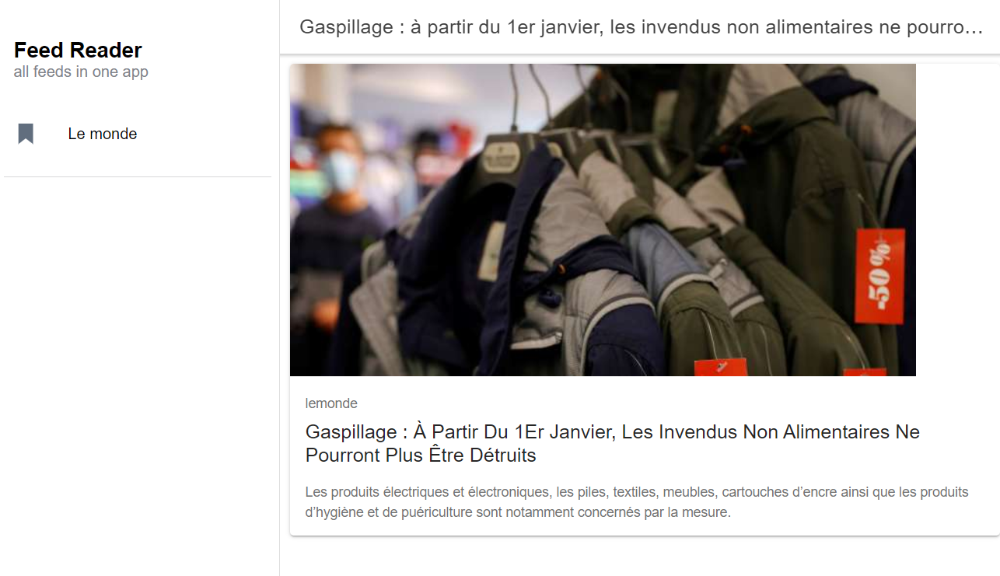

# headless-feed-reader

## Pre-requisite
Need running ``Docker`` for desktop

``make`` tool if not installed can be installed by ``sudo apt install make``

## Back-end

Init new laravel project with laravel sail:

``curl -s https://laravel.build/api | bash``

It will bring us an easy way to start and deploy the app

### Build & Run in local env

Laravel sail let us to run our app quickly by running the command : 
``./vendor/bin/sail up``

So Makefile contains 2 commands :

``make install-api`` : clone project and run the app

``make run-api`` : run the app when project is already cloned

### Development Steps

#### Controller

1 - As we don't mind to store anything, let's create a model & controller
without migration nor seeder / factory
``./vendor/bin/sail artisan make:model Article -c``

2 - To be able to wrap articles from different sources we design 2 API routes
to fetch articles by targeting a source : 
```http://host.com/articles?source=target```
and an other one to target a single article by his id : 
```http://host.com/articles/{id}?source=target```

We define 2 methods in the Controller ArticleController

``index``
to display all articles from a source

``show``
to display a single article from a source

we override ``validate`` method to check that the source exists, otherwise we throw an exception

``error`` method is designed to factorise Error messages (source not found)


#### Services

For the app purpose we have 3 files in our Services

1 - Our ApiWrapperFactory which will instantiate a real API
according the source passed in the parameter.

2 - Api Interface exposing method ``getAll`` and ``getOne`` to retrieve
data from wrapped API

3 - LemondeApi, our first API source based on rss feed from lemonde.fr

## Front-end

### Install ionic globally : 
``install -g @ionic/cli``

### Init new project
``ionic start``
For our app we are going to use slide template

### Service
To retrieve data from API we implement a service called ApiService
(would be better to call FeedApiService)

We define the base URL of the api in the environment file, to be able to 
change API host easily.

For this App we need only 2 method, ``getFeed`` and ``getFeeds``

### Menu 
List of available feeds are displayed in the left menu panel


### List of articles
For each selected source of feed we display available articles in
the right panel of this view.

### Detail page
When an article is clicked, we are routing to a new detail page
designed like a card to display selected content



## Future Evolution

Next 2 features for the back-end would be adding a sanctum authentication, and defining policies to control access
to the feeds.

So People, can see free source content when not authenticated, and can get access to more
feed sources or unlimited number of articles when logged, and may be more with a 
premium account.

From the front side, allow people to hide or star or add some sources to their favorite.


